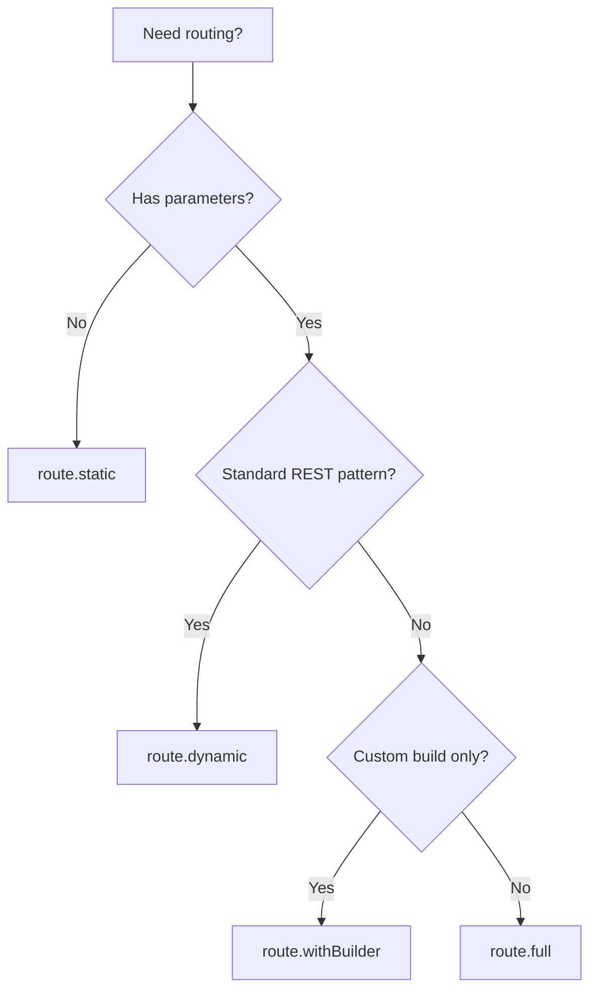

# Route Builder

The route builder is the heart of @adi-family/http. It provides a clean, type-safe API for defining routes with progressive complexity.

## Overview

The route builder has four methods, each suited for different use cases:

```typescript
import { route } from '@adi-family/http'

route.static()      // Static routes, no parameters
route.dynamic()     // Dynamic routes with auto-generated functions
route.withBuilder() // Custom build function, auto-generated parse/is
route.full()        // Complete control over everything
```

## route.static()

For routes without any parameters.

```typescript
const listUsersConfig = {
  method: 'GET',
  route: route.static('/api/users'),
  response: {
    schema: z.array(z.object({ id: z.string(), name: z.string() }))
  }
}
```

**Use when:**
- No URL parameters needed
- Simple, fixed paths

## route.dynamic()

For standard RESTful routes with URL parameters. **This is what you'll use 90% of the time.**

```typescript
const getUserConfig = {
  method: 'GET',
  route: route.dynamic(
    '/api/users/:id',
    z.object({ id: z.string() })
  ),
  response: {
    schema: z.object({ id: z.string(), name: z.string() })
  }
}
```

**Auto-generates:**
- ✅ `build()` - Builds URLs like `/api/users/123`
- ✅ `parse()` - Extracts params from URLs
- ✅ `is()` - Matches URLs against pattern

**Use when:**
- Standard REST routes
- Express-style patterns (`:paramName`)
- You want minimal boilerplate

### Multiple Parameters

```typescript
route.dynamic(
  '/api/projects/:projectId/tasks/:taskId',
  z.object({
    projectId: z.string(),
    taskId: z.string()
  })
)
```

### Nested Routes

```typescript
route.dynamic(
  '/api/orgs/:orgId/teams/:teamId/members/:memberId',
  z.object({
    orgId: z.string(),
    teamId: z.string(),
    memberId: z.string()
  })
)
```

## route.withBuilder()

For custom URL building logic while keeping auto-generated parsing.

```typescript
const getUserVersionedConfig = {
  method: 'GET',
  route: route.withBuilder({
    pattern: '/api/v:version/users/:id',
    params: z.object({
      version: z.number(),
      id: z.string()
    }),
    build: (params) => {
      // Custom build logic
      if (params.version === 1) {
        return `/api/legacy/users/${params.id}`
      }
      return `/api/v${params.version}/users/${params.id}`
    }
  })
}
```

**Auto-generates:**
- ✅ `parse()` - Extracts params from URLs
- ✅ `is()` - Matches URLs against pattern

**You provide:**
- 🎨 `build()` - Custom URL building logic

**Use when:**
- Need custom URL format
- Conditional routing based on params
- Legacy URL support
- A/B testing routes

## route.full()

Complete control over all routing functions. For advanced scenarios.

```typescript
const getTenantUserConfig = {
  method: 'GET',
  route: route.full({
    params: z.object({
      tenantId: z.string(),
      userId: z.string()
    }),
    build: (params) => {
      return `/api/users/${params.userId}?tenant=${params.tenantId}`
    },
    parse: (url) => {
      const userId = url.pathname.split('/').pop()!
      const tenantId = url.searchParams.get('tenant')!
      return { tenantId, userId }
    },
    is: (url) => {
      return /^\/api\/users\/[^/]+$/.test(url.pathname) &&
             url.searchParams.has('tenant')
    }
  })
}
```

**You provide:**
- 🎨 `build()` - How to build URLs from params
- 🎨 `parse()` - How to extract params from URLs
- 🎨 `is()` - How to match URLs

**Use when:**
- Subdomain-based routing
- Query parameter routing
- Custom URL formats
- Complex matching logic

### Examples with route.full()

#### Subdomain Routing

```typescript
route.full({
  params: z.object({
    tenant: z.string(),
    resource: z.string()
  }),
  build: (params) => {
    return `https://${params.tenant}.api.com/${params.resource}`
  },
  parse: (url) => {
    const tenant = url.hostname.split('.')[0]
    const resource = url.pathname.slice(1)
    return { tenant, resource }
  },
  is: (url) => {
    return url.hostname.endsWith('.api.com') && url.pathname !== '/'
  }
})
```

#### File Extension Routing

```typescript
route.full({
  params: z.object({
    path: z.string(),
    format: z.enum(['json', 'xml', 'csv'])
  }),
  build: (params) => {
    return `/api/files/${params.path}.${params.format}`
  },
  parse: (url) => {
    const match = url.pathname.match(/^\/api\/files\/(.+)\.(json|xml|csv)$/)
    if (!match) throw new Error('Invalid file path')
    return {
      path: match[1],
      format: match[2] as 'json' | 'xml' | 'csv'
    }
  },
  is: (url) => {
    return /^\/api\/files\/.+\.(json|xml|csv)$/.test(url.pathname)
  }
})
```

#### Query-based Routing

```typescript
route.full({
  params: z.object({
    tenantId: z.string(),
    userId: z.string()
  }),
  build: (params) => {
    return `/api/users/${params.userId}?tenant=${params.tenantId}`
  },
  parse: (url) => {
    const userId = url.pathname.split('/').pop()!
    const tenantId = url.searchParams.get('tenant')!
    return { tenantId, userId }
  },
  is: (url) => {
    return /^\/api\/users\/[^/]+$/.test(url.pathname) &&
           url.searchParams.has('tenant')
  }
})
```

## Choosing the Right Method



## Comparison Table

| Method | Build | Parse | Is | Use Case | Boilerplate |
|--------|-------|-------|----|-----------| ------------|
| `static` | Auto | Auto | Auto | Fixed paths | Minimal |
| `dynamic` | Auto | Auto | Auto | REST APIs | Minimal |
| `withBuilder` | Custom | Auto | Auto | Custom URLs | Low |
| `full` | Custom | Custom | Custom | Advanced | High |

## Type Safety

All route methods provide full TypeScript inference:

```typescript
const config = route.dynamic(
  '/api/users/:id',
  z.object({ id: z.string(), version: z.number().optional() })
)

// Client usage - TypeScript knows params type!
client.run(config, {
  params: { id: '123' }  // ✅ Valid
})

client.run(config, {
  params: { userId: '123' }  // ❌ TypeScript error
})

// Handler - ctx.params is fully typed!
handler(config, async (ctx) => {
  ctx.params.id      // ✅ string
  ctx.params.version // ✅ number | undefined
  ctx.params.foo     // ❌ TypeScript error
})
```

## Best Practices

::: tip Start with route.dynamic()
Use `route.dynamic()` for 90% of your routes. Only reach for `route.withBuilder()` or `route.full()` when you need special behavior.
:::

::: tip Keep patterns simple
Prefer `/api/users/:id` over complex regex patterns. Simple patterns are easier to understand and maintain.
:::

::: tip Use Zod for param schemas
Even though params aren't validated at runtime, Zod schemas provide excellent TypeScript inference.
:::

::: warning Don't validate params
URL parameters are NOT validated - they're only used for type inference and URL building. Validate `query` and `body` instead.
:::

## Next Steps

- **[Handlers](/guide/handlers)** - Learn how to implement handler logic
- **[Client](/guide/client)** - Use routes from the client side
- **[Custom Routes](/guide/custom-routes)** - Deep dive into route.full()
